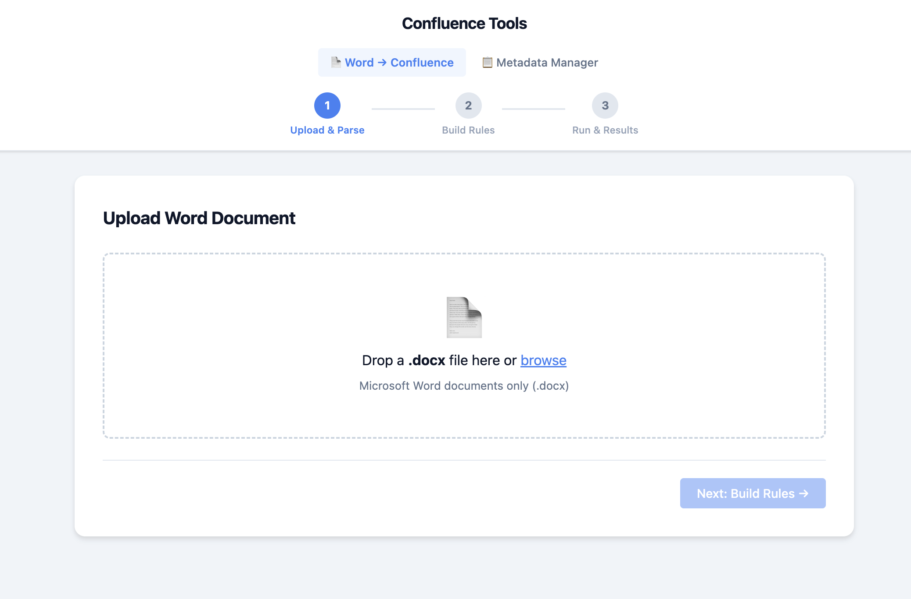
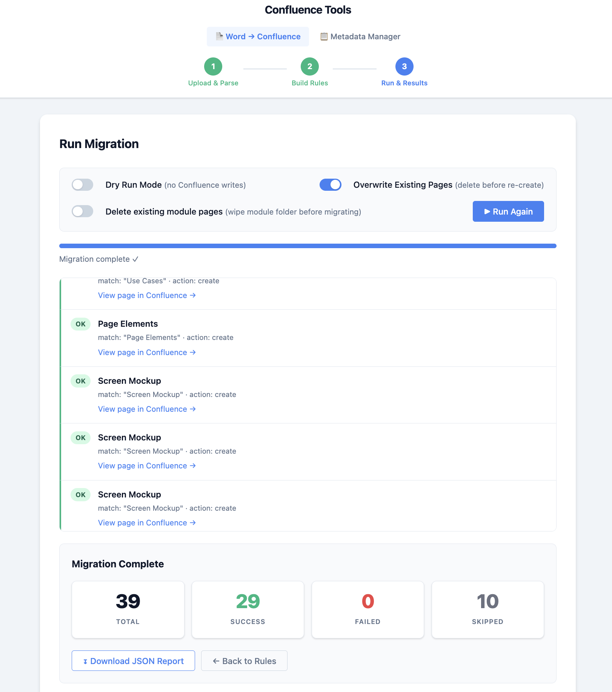
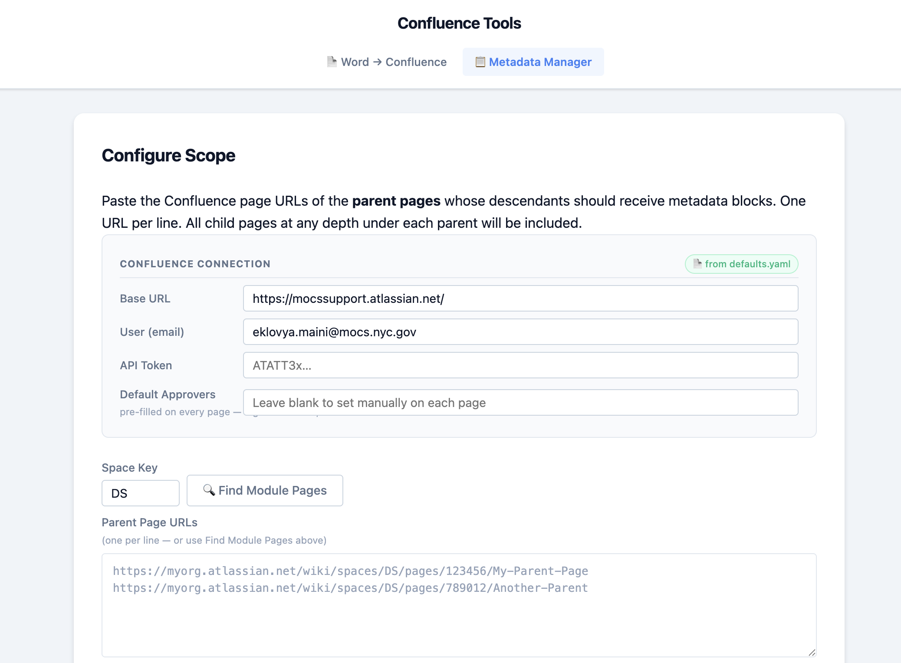
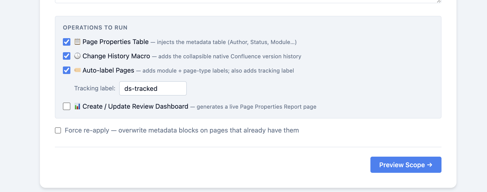

# Confluence Tools

A browser-based toolkit for migrating structured Word documents into Confluence page hierarchies and applying post-migration metadata operations at scale.

---

## Table of Contents

1. [Prerequisites](#prerequisites)
2. [Installation](#installation)
3. [Starting the App](#starting-the-app)
4. [Word → Confluence Migration](#word--confluence-migration)
   - [Step 1 — Upload & Parse](#step-1--upload--parse)
   - [Step 2 — Build Rules](#step-2--build-rules)
   - [Step 3 — Run & Results](#step-3--run--results)
5. [Section Defaulting Rules](#section-defaulting-rules)
   - [How Rules Work](#how-rules-work)
   - [Built-in Rules](#built-in-rules)
   - [Template Variables](#template-variables)
   - [Expand Tables to Pages](#expand-tables-to-pages)
   - [Expand Use Cases to Pages](#expand-use-cases-to-pages)
6. [Metadata Manager](#metadata-manager)
   - [Configure Scope](#configure-scope)
   - [Find Module Pages](#find-module-pages)
   - [Operations](#operations)
   - [Preview & Apply](#preview--apply)
7. [Configuration Files](#configuration-files)
8. [Project Structure](#project-structure)

---

## Prerequisites

| Requirement | Notes |
|---|---|
| **Python 3.9+** | Miniconda recommended |
| **Confluence Cloud or Data Center** | API token required |
| **Ollama** | Required only for LLM-powered sections (PlantUML diagrams, formatting) |

---

## Installation

```bash
# 1. Clone the repository
git clone https://github.com/eklovyamaini/smart-designs.git
cd smart-designs

# 2. (Recommended) create a virtual environment
python -m venv .venv
source .venv/bin/activate   # Windows: .venv\Scripts\activate

# 3. Install dependencies
pip install -r requirements.txt
```

### Confluence API Token

1. Log into Confluence → **Profile → Security → API tokens**
2. Click **Create API token**, give it a name, copy the value
3. Paste it into the **API Token** field in the app's connection settings

### Ollama (optional — for LLM features)

```bash
# Install Ollama from https://ollama.com, then pull a model
ollama pull llama3
```

LLM features (PlantUML diagram generation, rich text formatting) are disabled by default and can be enabled per-section in Step 2.

---

## Starting the App

```bash
./start.sh
```

Opens both services:

| Service | URL | Description |
|---|---|---|
| **Word → Confluence** | http://localhost:8001 | 3-step migration wizard |
| **Metadata Manager** | http://localhost:8001/metadata | Post-migration bulk operations |

Logs are written to `/tmp/doc_to_confluence.log`.

To stop:

```bash
./stop.sh
```

---

## Word → Confluence Migration

Access at **http://localhost:8001**

The wizard parses a `.docx` file, lets you review and adjust per-section Confluence mapping rules, then runs the migration with a live progress feed.



---

### Step 1 — Upload & Parse

Drop a `.docx` file into the upload zone or click **browse**. The parser extracts every heading (H1–H5) and builds a section tree. A badge shows how many sections were found.

**What the parser understands:**

- Headings → section hierarchy
- Tables → preserved as Confluence table markup
- Images → uploaded as Confluence attachments
- `Use Case: <name>` paragraphs → detected for automatic per-use-case page splitting
- PlantUML code blocks inside sections → passed to the LLM renderer

Click **Next: Build Rules →** once the document is parsed.

---

### Step 2 — Build Rules

Configure the Confluence connection and review the auto-generated per-section rule rows before running.

#### Confluence Connection

| Field | Description |
|---|---|
| **Base URL** | e.g. `https://yourorg.atlassian.net/` |
| **User (email)** | Your Atlassian account email |
| **API Token** | Generated from Confluence security settings |
| **Default Approvers** | Pre-filled on every Page Properties metadata table |

Click **Save as Defaults** to persist connection settings and LLM preferences across sessions.

#### LLM Settings

| Field | Description |
|---|---|
| **Model** | Ollama model name (e.g. `llama3`, `mistral`) |
| **Max Workers** | Parallel LLM threads (1–16) |
| **Temperature** | Output creativity (0 = deterministic, 1 = balanced) |
| **PlantUML Theme** | Visual theme for generated diagrams |

#### Per-Section Rule Rows

Each parsed section gets a rule row. The **Section Defaulting Rules** engine automatically matches the section title against the built-in rules and pre-fills:

- Page title template
- Confluence folder path
- LLM tasks to run
- Whether to expand table rows or use cases into child pages

You can override any field for any individual section before running. Use **Section Defaulting Rules** (top-right) to view or edit the underlying YAML.

**Actions per section:**

| Action | Effect |
|---|---|
| `create` | Create a new page (default) |
| `append` | Merge content into an existing page |
| `skip` | Exclude this section from migration |
| `folder_only` | Create a Confluence folder without a content page |

---

### Step 3 — Run & Results



| Toggle | Effect |
|---|---|
| **Dry Run** | Simulates the migration without writing to Confluence (default: on) |
| **Overwrite Existing Pages** | Updates pages that already exist (disabled in dry-run mode) |
| **Delete Existing Module Pages** | Removes the module folder tree before re-migrating for a clean slate |

Click **Start Migration**. A live progress bar and colour-coded result feed stream in real time:

- **OK** — page created/updated successfully
- **SKIP** — section excluded by rule or already exists (no overwrite)
- **WARN** — partial success (e.g. image attachment failed but page was created)
- **ERROR** — page creation failed

When complete, a summary shows **Total / Success / Failed / Skipped** counts. Click **Download JSON Report** to export the full per-section audit log.

---

## Section Defaulting Rules

### How Rules Work

Rules live in `doc_to_confluence/frontend/section_defaults.yaml` and are evaluated **top-to-bottom; first match wins**. Each rule can match on:

| Condition | Description |
|---|---|
| `title` | Case-insensitive regex against the section heading |
| `context` | All listed context variables must equal the expected values |
| `level` | Exact heading level (1 = H1, 2 = H2, 3 = H3/H4/H5) |

When a rule fires, its optional `capture` block updates context variables (shared state carried across the document), and its `apply` block sets the Confluence target for that section.

> Rules can be edited live in the browser via the **Section Defaulting Rules** button in Step 2, or directly in the YAML file.

---

### Built-in Rules

| # | Name | Matches | Action |
|---|---|---|---|
| 1 | **Module Header** | `^Module\s*[-–]\s*(.+)` | Skip — captures `module_name` into context |
| 2 | **Business Process** | `Business Process` | Create page with LLM PlantUML + formatting |
| 3 | **Accessing this Module** | `Accessing this Module` | Append content into the Business Process page |
| 4 | **Screen Designs Folder** | `Screen Designs` | Create a Confluence folder (no page) |
| 5 | **Screen Section** | `^(S\d{3})\s*[-–]\s*(.+)` | Create a screen folder; captures `screen_code` and `screen_title` |
| 6 | **Functional Description** | `Functional Description` | Create page under the screen folder |
| 7 | **Use Cases** | `Use Cases?` | Create container page + one child page per use case with PlantUML diagram |
| 8 | **Screen Mockup** | `Screen Mockup` | Create page, preserving images |
| 9 | **Page Elements** | `Page Elements` | Create page; expand table rows to individual child pages |
| 10 | **Page Element Detail** | context: `inside_page_elements = true` | Create child pages per H4 sub-section; expand table rows |
| 11 | **Catch-all** | `.*` | Skip — any section not matched above is excluded |

---

### Template Variables

Use `{{variable}}` syntax in `page_title` and `folder_path` values:

| Variable | Set by Rule | Example value |
|---|---|---|
| `{{module_name}}` | Rule 1 | `Contract Budget Amendment` |
| `{{screen_code}}` | Rule 5 | `S346` |
| `{{screen_title}}` | Rule 5 | `S346 – Contract Budget Amendment` |
| `{{original_title}}` | Always | The section's original heading text |

---

### Expand Tables to Pages

When `expand_tables_to_pages: true` is set on a rule (Rules 9 and 10 by default), every **data row** in the section's table becomes its own Confluence child page. The page title is built using `row_page_title`, where `{col_0}`, `{col_1}`, … are replaced with cell values at migration time.

**Example** — a Page Elements section with a 5-row table produces:

```
S346 - Page Elements              ← parent page
  ├─ S346 - Budget Amount         ← row 1
  ├─ S346 - Amendment Date        ← row 2
  ├─ S346 - Provider Name         ← row 3
  ├─ S346 - Status                ← row 4
  └─ S346 - Comments              ← row 5
```

Two document structures are handled automatically:

- **H4 sub-sections under Page Elements** → Rule 10 fires for each sub-section
- **Direct table under Page Elements (no sub-headings)** → Rule 9's `expand_tables_to_pages` handles the rows directly

---

### Expand Use Cases to Pages

When `expand_usecases_to_pages: true` is set (Rule 7 by default), each `Use Case: <name>` paragraph block in the section becomes its own child page. The LLM automatically generates a **PlantUML use-case diagram** for each block and embeds it alongside the description text and any inline tables.

**Example** — a Use Cases section with 3 use cases produces:

```
S346 – Contract Budget Amendment - Use Cases    ← lightweight container
  ├─ S346 - Submit Contract Budget Amendment    ← text + diagram
  ├─ S346 - Save Draft Amendment               ← text + diagram
  └─ S346 - Upload Supporting Document         ← text + diagram
```

---

## Metadata Manager

Access at **http://localhost:8001/metadata**

Apply post-migration metadata operations to pages in bulk. Works in two steps: configure scope → preview → apply.



---

### Configure Scope

Paste Confluence page URLs into the **Parent Page URLs** box (one per line). All descendant pages at any depth under each parent will be included in the operation.

#### Confluence Connection

Same fields as the migration tool. Settings saved via the migration tool's **Save as Defaults** are pre-filled automatically.

| Field | Description |
|---|---|
| **Base URL** | e.g. `https://yourorg.atlassian.net/` |
| **User (email)** | Atlassian account email |
| **API Token** | From Confluence security settings |
| **Default Approvers** | Pre-filled in every Page Properties table |

---

### Find Module Pages

Instead of pasting URLs manually, enter your **Space Key** (e.g. `DS`) and click **Find Module Pages**. The tool scans the Confluence space for pages whose titles match the `<Name> - Module` pattern and auto-populates the Parent Page URLs textarea.

> Typical result: _"✓ Found 6 module page(s) — URLs added above."_

---

### Operations

Select any combination of operations using the checkboxes. All operations are **duplicate-safe** — existing metadata blocks, macros, and labels are detected before applying to avoid duplication. Use **Force re-apply** to overwrite existing blocks.



#### 📋 Page Properties Table

Injects a structured Confluence Page Properties macro at the top of each page:

| Column | Source |
|---|---|
| Author | Confluence page creator |
| Status | Defaults to `Draft` |
| Module | Inferred from the page hierarchy title |
| Page Type | Inferred from the page title pattern |
| Last Updated | Page modification timestamp |
| Approvers | From Default Approvers field |

The Page Properties macro integrates with the Review Dashboard to create a live filterable report across all pages.

#### 🕓 Change History Macro

Adds a collapsible native Confluence **Page History** macro at the bottom of each page, letting readers browse the full revision history inline without leaving the page.

#### 🏷️ Auto-label Pages

Adds smart labels based on each page's position in the module hierarchy:

| Label type | Format | Example |
|---|---|---|
| Module name | kebab-case | `contract-budget-amendment` |
| Page type | kebab-case | `use-case`, `screen-design`, `functional-description` |
| Tracking label | configurable | `ds-tracked` (default) |

The tracking label sub-field appears when this operation is checked. Existing labels are never duplicated.

#### 📊 Create / Update Review Dashboard

Generates (or updates) a Confluence page containing a **Page Properties Report** macro — a live, filterable spreadsheet showing every page's review status, module, approvers, and more.

| Sub-field | Description |
|---|---|
| **Page Title** | Title of the dashboard page (default: `Review Dashboard`) |
| **Create / Update** | Creates the page or refreshes the macro if it already exists |

Space Key is reused from the **Find Module Pages** row — no duplicate entry needed. The dashboard page is placed at the space root and can be moved in Confluence afterwards.

> The dashboard updates automatically as page properties change — no manual refresh required.

#### Force Re-apply

Check **Force re-apply** to overwrite metadata blocks on pages that already have them. Useful after changing the default approvers or updating metadata templates.

---

### Preview & Apply

Click **Preview Scope →** to see a table of all pages that will be affected before committing any changes:

| Column | Description |
|---|---|
| Page Title | The Confluence page title |
| Module | Detected module name |
| Page URL | Direct link to the Confluence page |
| Status | `Has Blocks` / `Will Apply` / `Error` |

Review the list, then click **Run Selected Operations** to apply. A live progress log streams colour-coded results and a summary bar shows **Applied / Skipped / Errors / Total** counts.

---

## Configuration Files

| File | Purpose |
|---|---|
| `doc_to_confluence/frontend/section_defaults.yaml` | Section matching rules — edit in browser or directly |
| `doc_to_confluence/frontend/defaults.yaml` | Persisted connection settings, LLM config, space key |
| `doc_to_confluence/example_config.yaml` | Example migration config for reference |
| `.claude/launch.json` | Dev server config for Claude Code `preview_start` |
| `start.sh` / `stop.sh` | Service management scripts |
| `requirements.txt` | Python dependencies |

---

## Project Structure

```
smart-designs/
├── doc_to_confluence/           # Word → Confluence migration tool
│   ├── frontend/
│   │   ├── main.py              # FastAPI app — routes for migration + metadata
│   │   ├── section_defaults.yaml# Built-in section matching rules
│   │   ├── defaults.yaml        # Persisted user settings (git-ignored)
│   │   ├── templates/
│   │   │   ├── index.html       # 3-step migration wizard UI
│   │   │   └── metadata.html    # Metadata Manager UI
│   │   └── static/
│   │       ├── app.js           # Migration wizard logic
│   │       ├── metadata.js      # Metadata Manager logic
│   │       └── style.css        # Shared styles
│   ├── parser.py                # .docx → ParsedSection tree
│   ├── orchestrator.py          # Section → Confluence page mapping & creation
│   ├── llm_processor.py         # LLM task runner (PlantUML, formatting, use cases)
│   ├── confluence_client.py     # Confluence REST API wrapper
│   ├── metadata_manager.py      # Bulk metadata operations (properties, labels, tracker)
│   ├── plantuml_renderer.py     # PlantUML source → PNG via Ollama or local render
│   ├── config.py                # Pydantic models for migration config validation
│   └── models.py                # Shared data models
├── start.sh                     # Start the server (port 8001)
├── stop.sh                      # Stop the server
└── requirements.txt             # Python dependencies
```
